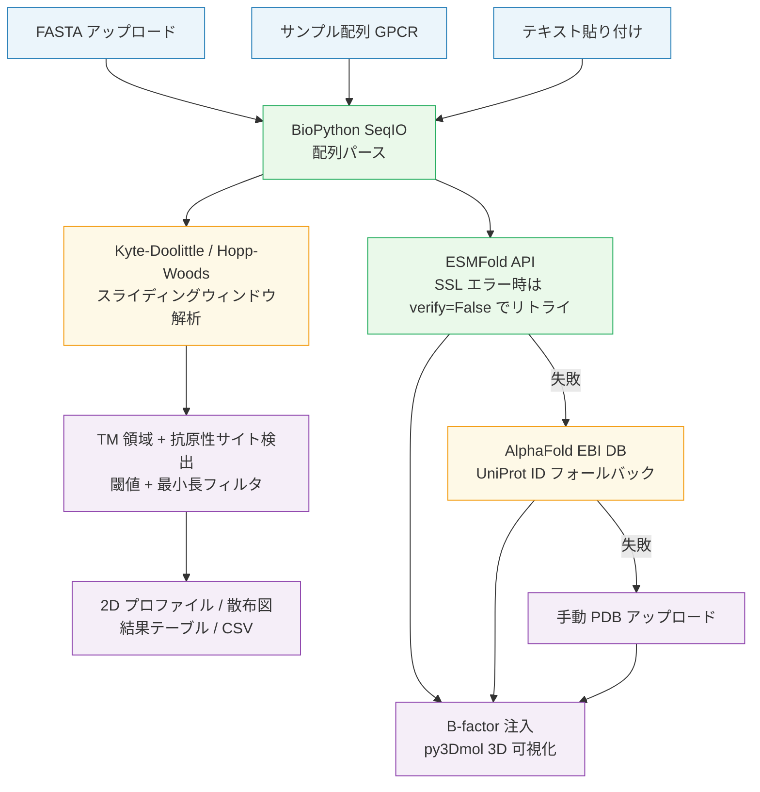

# Protein Hydrophobicity Profiler

タンパク質配列の膜貫通領域と抗原性サイトを Kyte-Doolittle / Hopp-Woods デュアルスケールで解析し、ESMFold 予測 3D 構造に疎水性スコアをマッピングする Streamlit Web アプリ。

---

## 解決した課題

膜タンパク質の**膜貫通領域予測**と**抗原性サイト予測**は、従来それぞれ別のツールで行う必要があった。疎水性（膜内部への埋没傾向）を示す Kyte-Doolittle スケールと、抗原性（表面露出・免疫原性）を示す Hopp-Woods スケールは正負の向きが逆であり、1 つのスケールだけでは「どの領域が膜内に埋まり、どの領域が抗体に認識されやすいか」という 2 つの問いに同時に答えられない。

本ツールは 2 スケールの同時解析・可視化をブラウザだけで完結させ、ESMFold による 3D 構造予測と疎水性スコアのマッピングで「残基ごとの膜内/表面の配置」を立体的に確認できるようにした。抗体設計・ワクチンエピトープ選定・膜タンパク質トポロジー解析の事前スクリーニングに利用できる。

---

## 主要機能

- **デュアルスケール同時解析** — Kyte-Doolittle（疎水性・TM 候補）と Hopp-Woods（親水性・抗原性サイト候補）をスライディングウィンドウで並行計算
- **2D プロファイル + 散布図** — 上下 2 段のデュアルパネルプロットと KD vs HW 散布図で膜貫通領域・抗原性サイトを色分けハイライト
- **3 段階 API フォールバック** — ESMFold API → AlphaFold EBI DB（UniProt ID）→ 手動 PDB アップロードの順に自動フォールバックし、API 停止時でも 3D 可視化を維持
- **疎水性スコアの 3D マッピング** — B-factor 注入でスコアグラデーション（blue=低 → red=高）または TM/抗原性領域ハイライトを py3Dmol で表示
- **インタラクティブパラメータ + CSV エクスポート** — ウィンドウサイズ・閾値・最小長をサイドバーでリアルタイム調整し、全残基スコアを CSV ダウンロード可能

---

## 技術スタック

| カテゴリ | 使用技術 |
|---|---|
| 配列解析 | BioPython SeqIO — FASTA パース；Kyte-Doolittle / Hopp-Woods スケール定義 |
| 数値解析 | NumPy `np.convolve` — スライディングウィンドウの高速畳み込み |
| 構造予測 | ESMFold API（Meta）/ AlphaFold EBI DB — 3 段階フォールバック |
| 3D 可視化 | py3Dmol + `streamlit.components.v1.html()` — B-factor グラデーション表示 |
| 2D 可視化 | Matplotlib — デュアルパネルプロファイル・KD vs HW 散布図 |
| Web UI | Streamlit — session_state による PDB キャッシュ・サイドバーパラメータ管理 |

---

## アーキテクチャ



### ファイル別役割

| ファイル | 役割 |
|---|---|
| `hydrophobicity_profiler.py` | 全処理を単一ファイルに集約（約 900 行）。スケール定義・解析エンジン・構造取得 API・3D/2D 可視化・Streamlit UI |
| `requirements.txt` | 依存ライブラリ（streamlit / biopython / matplotlib / requests / numpy / py3Dmol） |

---

## 使用方法

### セットアップ

```bash
git clone https://github.com/TSUBAKI0531/protein-hydrophobicity-profiler.git
cd protein-hydrophobicity-profiler
pip install -r requirements.txt
streamlit run hydrophobicity_profiler.py
# → http://localhost:8501
```

### クイックテスト（サンプル配列）

1. **Sample (GPCR)** タブを開き「▶ Run with sample」をクリック
2. β2 アドレナリン受容体（7 回膜貫通 GPCR、UniProt: P07550）で解析が実行される
3. **2D Profile** タブで KD スコアが高い TM 候補領域（赤）と HW スコアが高い抗原性サイト（青）を確認
4. **KD vs HW** タブで 2 スケールの相関散布図を確認
5. サイドバーの **Enable 3D structure view** をオンにして **3D Structure** タブで 3D マッピングを確認

### 実データ解析（FASTA ファイル）

1. **Upload FASTA** タブからファイルをアップロード（`.fasta` / `.fa` / `.faa` / `.txt`）
2. サイドバーで Window size・KD TM threshold（デフォルト 1.6）・HW Antigenic threshold（デフォルト 1.0）を調整
3. **Results** タブで TM 候補・抗原性サイトの一覧を確認し CSV をダウンロード

---

## 設計上の工夫

**3 段階 API フォールバック設計**
ESMFold API は SSL 証明書の問題が既知であり、`verify=True` での接続失敗後に `verify=False` でリトライする 2 段階の試みを行う。それでも失敗した場合は AlphaFold EBI DB（UniProt ID 入力）、最終的には手動 PDB アップロードへフォールバックする。API 停止時でも 3D 可視化機能が完全に失われない設計。

**B-factor 注入による 3D スコアマッピング**
`inject_bfactor()` は PDB の B-factor カラム（60–65 桁）を残基ごとの疎水性スコアに置換する。スコアは 0–100 にスケーリングされ、py3Dmol の `gradient: "rwb"` カラースキームで青（低）→ 白 → 赤（高）のグラデーション表示に直結する。外部ライブラリ追加なしで定量情報を 3D 構造上に可視化する設計。

**session_state による API コールの保護**
予測済みの PDB 文字列を `st.session_state` に `hash(sequence)` をキーとしてキャッシュすることで、ウィンドウサイズや閾値変更による UI 再描画時に ESMFold への再リクエストが発生しない。最大 120 秒かかる API コールをユーザー操作ごとに繰り返さないための設計。

**KD/HW スケールの正負対称性への対応**
Kyte-Doolittle は正 = 疎水性、Hopp-Woods は正 = 親水性（2 スケールで正負が逆）。`detect_regions()` はどちらも `direction="high"` で検出する設計になっており、KD では高スコア（疎水性）= TM 候補、HW では高スコア（親水性）= 抗原性サイト候補として、同一の関数で両方向の検出を統一的に扱っている。

---

## 今後の拡張可能性

- **膜タンパク質クラス分類** — TM 領域数・間隔パターンに基づく GPCR / イオンチャンネル / トランスポーターの自動分類
- **マルチ配列バッチ処理** — 複数 FASTA レコードのサマリーテーブル一括出力（現在は 1 配列ずつタブ表示）
- **AlphaFold2 / ColabFold ローカル予測** — ESMFold API 依存からの脱却と長い配列（> 400 aa）への完全対応

---

## ライセンス

MIT License

---

## Author

GitHub: [@TSUBAKI0531](https://github.com/TSUBAKI0531)
